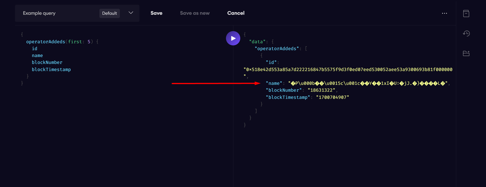

# StakedFLIP Omega Governance Subgraph
This subgraph includes the calldata of a proposal with the `TransactionProposed` event in the `proposalCalldata` field. This prevents the need to first query the `transactionHash` from the subgraph, and then another query to get the calldata.

View the subgraph [here](https://thegraph.com/hosted-service/subgraph/thunderhead-labs/stakedflip-omega-subgraph).
## How to Use

First make a query to get a `TransactionProposed` event.

```graphql
{
  transactionProposeds(first: 1) {
    transactionHash
    safe
    blockNumber
    proposalCalldata
    blockTimestamp
  }
}
```

Response:
```
{
  "data": {
    "transactionProposeds": [
      {
        "transactionHash": "0x003303ab015eb7096738f5708c4a8c294655a5ae99e3ef7211d20c1c95c50e14",
        "safe": "0x7a8a1e6966ac5b67aca3c9308fa798bb56ecac38",
        "blockNumber": "18639688",
        "proposalCalldata": "0x42ffdfaf000000000000000000000000000000000000000000000000000000000000006000000000000000000000000000000000000000000000000000000000000000010000000000000000000000000000000000000000000000000000000000000001000000000000000000000000000000000000000000000000000000000000001e9a1017e01e99e1042adda6f4518d54305129fd52615f0baf6bf99c82a29e3556a43ec963dc94a62ded7293598304979c2409fd2feb0adbb467637c64d86db467ded123c308290da7a304d2ff38accfdb6f3a0bf6b409da1b11456bd67576233b2e87ba9d98e430c279a07d3795cc0820b36f9dee209a8df3bf3b5ae67491c96180cb3ffc8fb0fb897355e699b722503d062500fb1870f8b2339bf5388ae00503e2a92b25cd26ccce1287538d972950f55b9c334266a285a83684503e2404407a964e728f3b7454c3d69cb13bbafd137a309e68be85cecec6bd34898034ef2f02dc8ebf63cb9aaf432eca6e57c6108029c8038178879f37e50b8e8aa0ae27aa0bf0adebf72a0df5ac40ec64f62d914231dc20491bd9dad7151506db23dc14b6412ccb24499f9c4a7d0338c607b2d744ca31f6cf6816660ac5a89d135e49cf8d5b38ce847d491c991398b3d0de71bc387d36db6be5399442e524159eef07057450f8a0f7dd834daf959e5486839514d94bc3be20410a5adbe8ba92812f8ce8ac4708ef68e70d8e91f4d9f7d01ddc60cf094a5dec7d28f83053eba66179042d46520c6bc3fb239c8036498eda2210b0de644355c152cd65eb4cada67402bba4404fac2b2340882bc653c2f0322b363fa3f8e4dce4e9114057e547882d1838fa20734c0d8314554b313f4edec59efb29546ee95f223630eb79b6c35292772dc7ae24c2cd4d7966488b43cab41562d946e0194c2150c4a6a7c1f2fba212792705820fa06c6a414c38ff9ea947b2b1e4426b53a75832b2d2c68394a1bf10783e0e973b8483cfabe1ca40752041d58ba7fa13a13ac514c438289044d819a001a1592019b2717fd1195ed1c6e8c74a5e61b9639aef8fab6e0843b50a3b248e4cc5ba3c70b02d46467ae0a8ca9d9f068c30df564a6d69f6e7e257638fc9dbbbf53614bf256e3df92f3305007b95e0f426e9e95f795722e5b90b8abe4f466ebbb15895143bfcb2bf03269ed080efff2f5fa8aa86ec20e8e186fec7db3992ab2424cae7f601cea8a5ed7234ab0151a4f440f1b2f775c403e2524a533bcbb3dd334bf3ae2b543e8fd38f2fd7f2cd737a85b8dd187602557d05d23703fa171a2baebb1730af15b2dbb9bdf5c14c5f5c5911ccff21cd3f3798f962e53b271acdb89ebcb1a36d58c4a881f59a55c2d9caad709fca6d63ce50de67c7d9615d721e8bca43445cc772d67c0214a43e9268b9c39a89118f801aefd099652391aa1447b6ebe222f88e6f02af56a82f5241d6eba3cf8f176782dc3d99dd84eb45f4d6f6ae968119025401b20d1e567abd07aecce0a0503ef831d35bbaebe0dd27f6f70978f86b89c81c64",
        "blockTimestamp": "1700806187"
      }
    ]
  }
}
```

Now, decode the `proposalCalldata`

```
cast 4byte-decode 0x42ffdfaf000000000000000000000000000000000000000000000000000000000000006000000000000000000000000000000000000000000000000000000000000000010000000000000000000000000000000000000000000000000000000000000001000000000000000000000000000000000000000000000000000000000000001e9a1017e01e99e1042adda6f4518d54305129fd52615f0baf6bf99c82a29e3556a43ec963dc94a62ded7293598304979c2409fd2feb0adbb467637c64d86db467ded123c308290da7a304d2ff38accfdb6f3a0bf6b409da1b11456bd67576233b2e87ba9d98e430c279a07d3795cc0820b36f9dee209a8df3bf3b5ae67491c96180cb3ffc8fb0fb897355e699b722503d062500fb1870f8b2339bf5388ae00503e2a92b25cd26ccce1287538d972950f55b9c334266a285a83684503e2404407a964e728f3b7454c3d69cb13bbafd137a309e68be85cecec6bd34898034ef2f02dc8ebf63cb9aaf432eca6e57c6108029c8038178879f37e50b8e8aa0ae27aa0bf0adebf72a0df5ac40ec64f62d914231dc20491bd9dad7151506db23dc14b6412ccb24499f9c4a7d0338c607b2d744ca31f6cf6816660ac5a89d135e49cf8d5b38ce847d491c991398b3d0de71bc387d36db6be5399442e524159eef07057450f8a0f7dd834daf959e5486839514d94bc3be20410a5adbe8ba92812f8ce8ac4708ef68e70d8e91f4d9f7d01ddc60cf094a5dec7d28f83053eba66179042d46520c6bc3fb239c8036498eda2210b0de644355c152cd65eb4cada67402bba4404fac2b2340882bc653c2f0322b363fa3f8e4dce4e9114057e547882d1838fa20734c0d8314554b313f4edec59efb29546ee95f223630eb79b6c35292772dc7ae24c2cd4d7966488b43cab41562d946e0194c2150c4a6a7c1f2fba212792705820fa06c6a414c38ff9ea947b2b1e4426b53a75832b2d2c68394a1bf10783e0e973b8483cfabe1ca40752041d58ba7fa13a13ac514c438289044d819a001a1592019b2717fd1195ed1c6e8c74a5e61b9639aef8fab6e0843b50a3b248e4cc5ba3c70b02d46467ae0a8ca9d9f068c30df564a6d69f6e7e257638fc9dbbbf53614bf256e3df92f3305007b95e0f426e9e95f795722e5b90b8abe4f466ebbb15895143bfcb2bf03269ed080efff2f5fa8aa86ec20e8e186fec7db3992ab2424cae7f601cea8a5ed7234ab0151a4f440f1b2f775c403e2524a533bcbb3dd334bf3ae2b543e8fd38f2fd7f2cd737a85b8dd187602557d05d23703fa171a2baebb1730af15b2dbb9bdf5c14c5f5c5911ccff21cd3f3798f962e53b271acdb89ebcb1a36d58c4a881f59a55c2d9caad709fca6d63ce50de67c7d9615d721e8bca43445cc772d67c0214a43e9268b9c39a89118f801aefd099652391aa1447b6ebe222f88e6f02af56a82f5241d6eba3cf8f176782dc3d99dd84eb45f4d6f6ae968119025401b20d1e567abd07aecce0a0503ef831d35bbaebe0dd27f6f70978f86b89c81c64

"setValidatorsStatus(bytes32[],bool,bool)"
[0x9a1017e01e99e1042adda6f4518d54305129fd52615f0baf6bf99c82a29e3556, 0xa43ec963dc94a62ded7293598304979c2409fd2feb0adbb467637c64d86db467, 0xded123c308290da7a304d2ff38accfdb6f3a0bf6b409da1b11456bd67576233b, 0x2e87ba9d98e430c279a07d3795cc0820b36f9dee209a8df3bf3b5ae67491c961, 0x80cb3ffc8fb0fb897355e699b722503d062500fb1870f8b2339bf5388ae00503, 0xe2a92b25cd26ccce1287538d972950f55b9c334266a285a83684503e2404407a, 0x964e728f3b7454c3d69cb13bbafd137a309e68be85cecec6bd34898034ef2f02, 0xdc8ebf63cb9aaf432eca6e57c6108029c8038178879f37e50b8e8aa0ae27aa0b, 0xf0adebf72a0df5ac40ec64f62d914231dc20491bd9dad7151506db23dc14b641, 0x2ccb24499f9c4a7d0338c607b2d744ca31f6cf6816660ac5a89d135e49cf8d5b, 0x38ce847d491c991398b3d0de71bc387d36db6be5399442e524159eef07057450, 0xf8a0f7dd834daf959e5486839514d94bc3be20410a5adbe8ba92812f8ce8ac47, 0x08ef68e70d8e91f4d9f7d01ddc60cf094a5dec7d28f83053eba66179042d4652, 0x0c6bc3fb239c8036498eda2210b0de644355c152cd65eb4cada67402bba4404f, 0xac2b2340882bc653c2f0322b363fa3f8e4dce4e9114057e547882d1838fa2073, 0x4c0d8314554b313f4edec59efb29546ee95f223630eb79b6c35292772dc7ae24, 0xc2cd4d7966488b43cab41562d946e0194c2150c4a6a7c1f2fba212792705820f, 0xa06c6a414c38ff9ea947b2b1e4426b53a75832b2d2c68394a1bf10783e0e973b, 0x8483cfabe1ca40752041d58ba7fa13a13ac514c438289044d819a001a1592019, 0xb2717fd1195ed1c6e8c74a5e61b9639aef8fab6e0843b50a3b248e4cc5ba3c70, 0xb02d46467ae0a8ca9d9f068c30df564a6d69f6e7e257638fc9dbbbf53614bf25, 0x6e3df92f3305007b95e0f426e9e95f795722e5b90b8abe4f466ebbb15895143b, 0xfcb2bf03269ed080efff2f5fa8aa86ec20e8e186fec7db3992ab2424cae7f601, 0xcea8a5ed7234ab0151a4f440f1b2f775c403e2524a533bcbb3dd334bf3ae2b54, 0x3e8fd38f2fd7f2cd737a85b8dd187602557d05d23703fa171a2baebb1730af15, 0xb2dbb9bdf5c14c5f5c5911ccff21cd3f3798f962e53b271acdb89ebcb1a36d58, 0xc4a881f59a55c2d9caad709fca6d63ce50de67c7d9615d721e8bca43445cc772, 0xd67c0214a43e9268b9c39a89118f801aefd099652391aa1447b6ebe222f88e6f, 0x02af56a82f5241d6eba3cf8f176782dc3d99dd84eb45f4d6f6ae968119025401, 0xb20d1e567abd07aecce0a0503ef831d35bbaebe0dd27f6f70978f86b89c81c64]
true
true
```

Now we have data that we can show on the governance frontend for each proposal. 

If you'd like to get the calldata for the entire transaction, you can query the `addTransactionCalldata` field.

## How To Approach this on the frontend. 
`cast 4byte-decode` is a CLI command and thus not available on frontend. There is site which lets you decode arbitrary calldata: [calldata.swiss-knife.xyz](https://calldata.swiss-knife.xyz) - there are many more.  

You can see how he does it [here](https://github.com/apoorvlathey/eth-calldata-decoder/blob/657bc9d7298dd83030099385fc5ac378624cf5f4/src/components/Body/index.js#L70). The first decoding uses a known function signature: `addTransaction(address,(address,uint256,bytes,uint8,uint256,uint256,uint256,address,address,uint256),bytes)`, however the second decoding could be an arbitrary function signature (you can view a database of them [here](https://openchain.xyz/signatures), they have an api). If the solution in the link above does not work, someone else has definitely made a library to do this easily in typescript. 

## Consideration
All proposals so far have been added with [`addTransaction`](https://github.com/thunderhead-labs/frax-governance/blob/master/src/FraxGovernorOmega.sol#L247), but its possible to add them with [`batchAddTransaction`](https://github.com/thunderhead-labs/frax-governance/blob/master/src/FraxGovernorOmega.sol#L306) which has a different function signature. Logic exists in the event handler to handle this case, but it is commented it out and hasn't been tested due to this event not existing yet. If it encounters this, it will enter `unableToDecode(uint256) 0` as the encoded calldata. After this, one needs to figure out how to get the log index of an event and uncomment/test the logic. 

## Known Issues
The subgraph does not properly decode the `name` of `OperatorAdded` event. If this is needed we can look into fixing it. 
